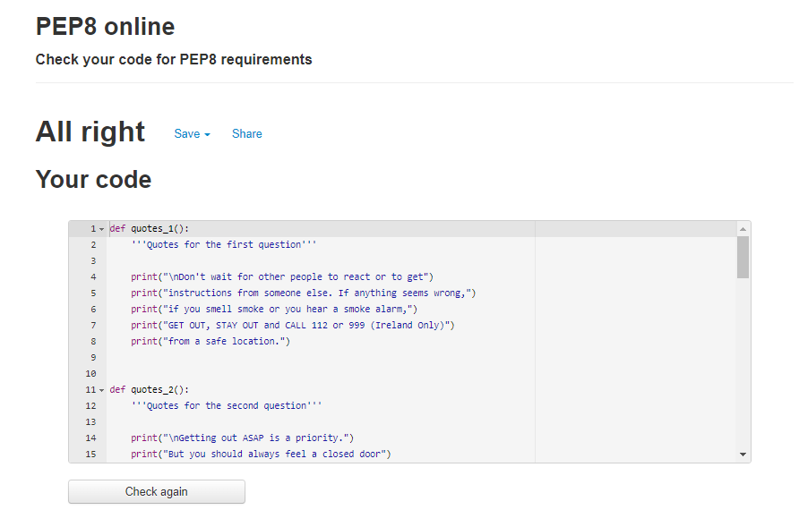
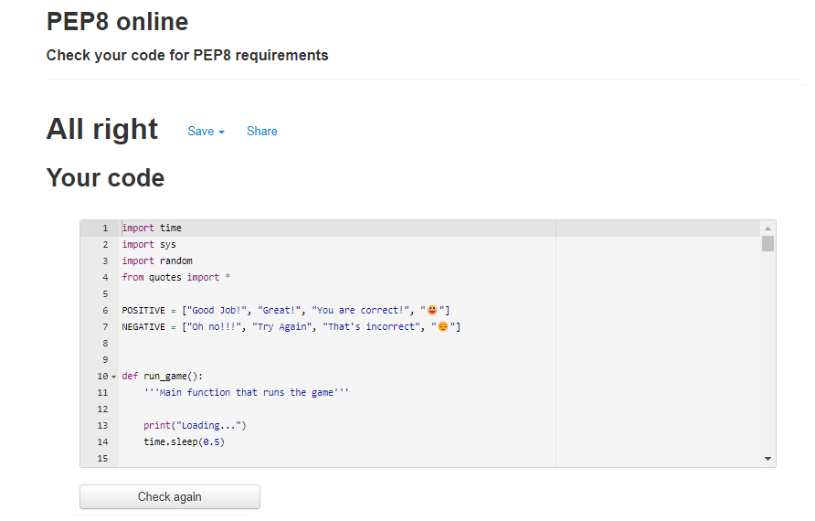

# Escape the Fire: Milestone Project 3

## Introduction

Escape the fire is a Quiz game that runs on python in a Command Line Interface. 
The Game objective is to test and teach the user habilities on how to react in a House Fire situation.

[Escape the Fire Live Website](https://survive-the-fire.herokuapp.com/)

[Escape the Fire Repository](https://github.com/gioZAK/survive-the-fire)

# Table of Contents

1. [User Stories](#userstories)
    1. [First Time User](#firstuser)
    2. [Site Owner](#siteowner)
2. [Tools and Technology](#technology)
3. [Validation](#validation)
4. [Testing](#testing)
5. [Bugs and Issues](#bugs)
6. [Deployment](#deployment)
7. [Credits](#credits)

## User Stories 

### As a first time user to this site, I want to... 
-   Easily understand how the game works.
-   Play the Game
-   Learn and test my habilities on how to react during a house fire.

### As a site owner, I want to... 
-   Teach people about the basics on how to react during a house fire.

##  Tools and Technology 

### Language Used:

-   [Python 3.8.10](https://www.python.org/)

### Technology Used:

-   [Git](https://git-scm.com/)
    - Git was used for version control by utilizing the Gitpod terminal to commit to Git and Push to GitHub.
-   [GitHub](https://github.com/)
    - GitHub is used to store the projects code after being pushed from Git.
-   [Gitpod](https://gitpod.io/)
    - GitPod as the IDE Editor.
-   [Heroku](https://heroku.com)
    - Heroku was used to deploy the website.

## Validation 

Pep8 was used to test 2 files and no errors were found.

## Testing 

### Manual Testing 

-   Manual testing was perfomed on every variation.

## Bugs and Issues 

-   No bugs were found.

## Deployment 

 ### Heroku
 This application has been deployed from Github using Heroku. Here's how:
 1. Create an account at [heroku.com](https://.heroku.com/)
 2. Create a new app, add app name and your region
 3. Click on create app
 4. Go to "Settings"
 5. Inside Config Vars add PORT = 8000
 6. For this project, I set buildpacks to <Python> and <NodeJS> in that order.
 7. Go to "Deploy" and at "Deployment method", click on "Connect to Github"
 8. Enter your repository name and click on it when it shows below
 9. Choose the branch you want to buid your app from
 10. If desired, click on "Enable Automatic Deploys", which keeps the app up to date with your Github repository
 11. All done!

## Credits 

-   [American Red Cross: Escape a Burning Building Quiz](https://www.redcross.org/get-help/how-to-prepare-for-emergencies/types-of-emergencies/fire/escape-a-burning-building-quiz.html)   
-   Code Institute Template.
